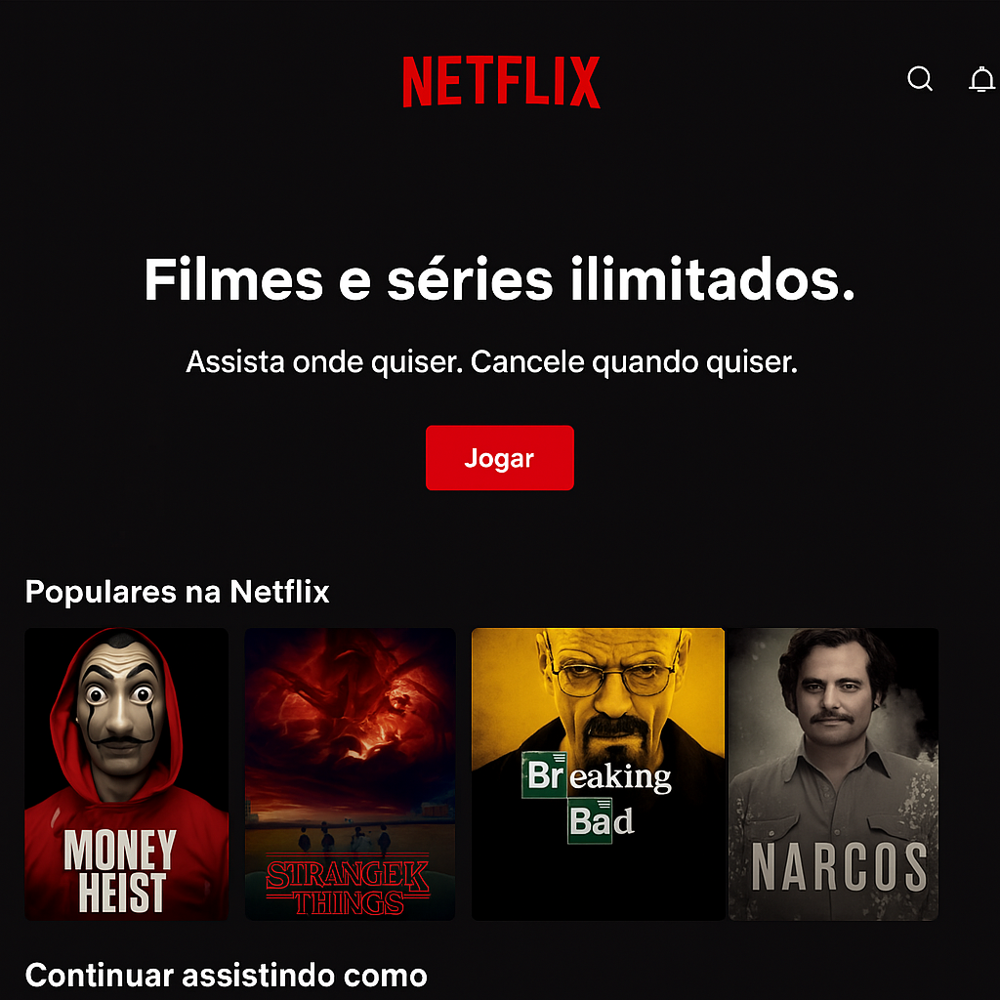

# 🍿 Clone Netflix

Um clone da interface da Netflix, desenvolvido como exercício prático para reforçar conceitos de HTML, CSS e JavaScript. O projeto simula a aparência visual da plataforma, com um layout responsivo e interativo.

🔗 **Acesse o site online**: [Clique aqui para ver](https://beatriz-oliveira-dev.github.io/clone-netflix/)

## 🎯 Objetivo

Reproduzir a interface da Netflix com foco em:
- Estruturação semântica com HTML5
- Estilização moderna com CSS3
- Uso de Flexbox e Grid
- Design responsivo
- Organização de componentes visuais

## 🚀 Tecnologias utilizadas

- HTML5  
- CSS3  
- JavaScript (opcional/futuro)  
- Font Awesome (para ícones)

## 📸 Demonstração



## 📁 Estrutura de pastas

```
clone-netflix/
├── imagens/
│   └── (imagens utilizadas no projeto)
├── style/
│   └── style.css
├── index.html
└── README.md
```

## 📱 Responsividade

O layout se adapta a diferentes tamanhos de tela (desktop, tablet, mobile), garantindo uma boa experiência do usuário em qualquer dispositivo.

## 💡 Melhorias futuras

- Implementar sliders/carrosséis com JavaScript
- Adicionar integração com API de filmes/séries (como The Movie DB)
- Criar componentes reutilizáveis
- Dark mode real

## 👩‍💻 Desenvolvido por

**Beatriz Oliveira**  
[LinkedIn](https://www.linkedin.com/in/beatriz-oliveira-dev/) | [GitHub](https://github.com/Beatriz-Oliveira-Dev)
